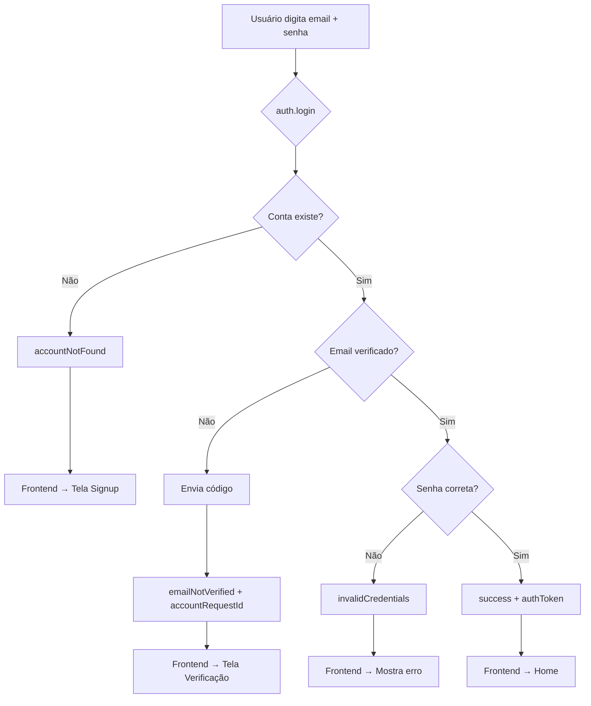
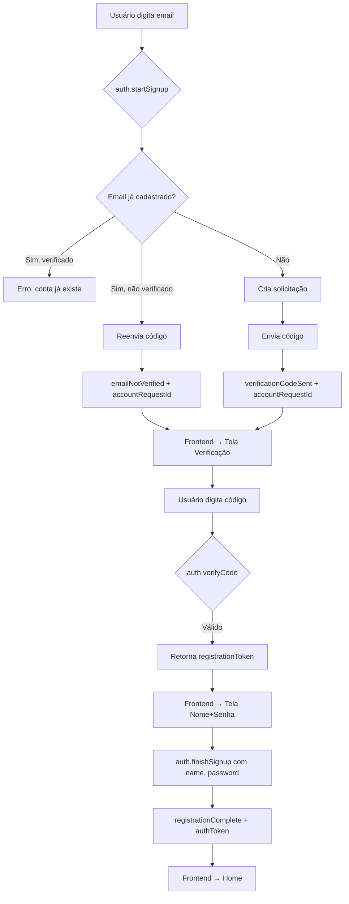
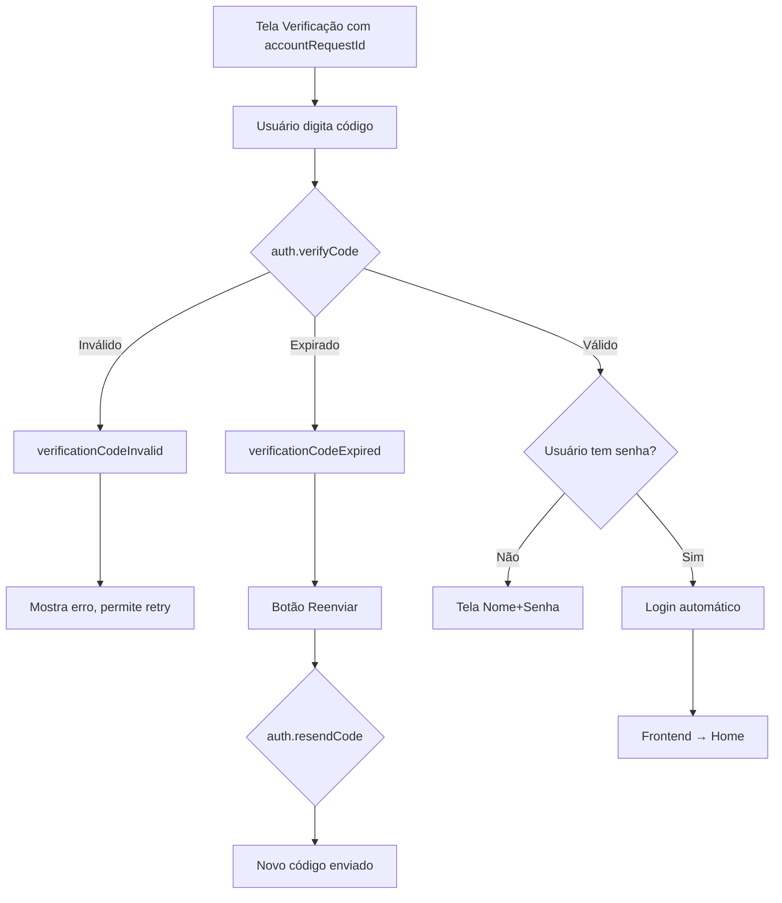

# Design: Fluxo de Autenticação Backend-First

> **Data:** 2026-01-09  
> **Status:** Aprovado  
> **Fase:** Backend primeiro, depois Frontend

---

## 1. Objetivo

Implementar um fluxo de autenticação robusto com as seguintes características:

- **Verificação de email obrigatória** antes de acessar o app
- **Backend com respostas claras** para o frontend (exceções + objetos de resultado)
- **Testes de integração** cobrindo todos os cenários
- **Frontend refatorado** com Provider, get_it e MVVM

---

## 2. Regras de Negócio

| Cenário | Comportamento |
|---------|---------------|
| Login sem conta | Redireciona para signup |
| Login com email não verificado | Envia código automaticamente, redireciona para verificação |
| Signup com email novo | Envia código, redireciona para verificação |
| Signup com email existente não verificado | Reenvia código, redireciona para verificação |
| Signup com email já verificado | Erro: conta já existe |
| Verificação bem-sucedida | Coleta nome + senha, cria conta, redireciona para home |

---

## 3. Modelos de Dados

### 3.1 AuthStatus (Enum)

```yaml
# auth_status.spy.yaml
enum: AuthStatus
values:
  - success                 # Login bem-sucedido
  - accountNotFound         # Conta não existe → signup
  - emailNotVerified        # Email pendente → verificação
  - invalidCredentials      # Senha incorreta
  - verificationCodeSent    # Código enviado (signup)
  - verificationCodeInvalid # Código inválido
  - verificationCodeExpired # Código expirou
  - registrationComplete    # Registro finalizado
```

### 3.2 AuthResult (Modelo de Resposta)

```yaml
# auth_result.spy.yaml
class: AuthResult
fields:
  status: AuthStatus
  message: String?
  accountRequestId: UuidValue?  # Para fluxo de verificação
  registrationToken: String?    # Token para finishSignup
  authToken: String?            # Token JWT se login bem-sucedido
```

---

## 4. API Endpoints

| Endpoint | Input | Output | Descrição |
|----------|-------|--------|-----------|
| `auth.login` | email, password | `AuthResult` | Tenta login |
| `auth.startSignup` | email | `AuthResult` | Inicia cadastro |
| `auth.verifyCode` | accountRequestId, code | `AuthResult` | Valida código |
| `auth.finishSignup` | token, name, password | `AuthResult` | Completa cadastro |
| `auth.resendCode` | accountRequestId | `AuthResult` | Reenvia código |

---

## 5. Fluxos

### 5.1 Fluxo de Login



### 5.2 Fluxo de Signup



### 5.3 Fluxo de Verificação (vindo do login)



---

## 6. Arquitetura

### 6.1 Backend (Serverpod)

```
kanew_server/lib/src/
├── auth/
│   ├── auth_endpoint.dart          # [NOVO] Endpoint customizado
│   └── email_idp_endpoint.dart     # Extensão existente
├── models/
│   ├── auth_result.spy.yaml        # [NOVO]
│   └── auth_status.spy.yaml        # [NOVO]
├── services/
│   └── auth_service.dart           # [NOVO] Lógica de auth
└── test/integration/
    └── auth_test.dart              # Expandir testes
```

### 6.2 Frontend (MVVM + Provider + get_it)

```
kanew_flutter/lib/
├── core/
│   ├── di/
│   │   └── injection.dart          # get_it setup
│   └── services/
│       └── auth_service.dart       # Abstração do client
├── features/
│   └── auth/
│       ├── data/
│       │   └── auth_repository.dart
│       ├── domain/
│       │   └── auth_state.dart
│       └── presentation/
│           ├── viewmodels/
│           │   └── auth_viewmodel.dart
│           └── screens/
│               ├── login_screen.dart
│               ├── signup_screen.dart
│               └── verification_screen.dart
```

---

## 7. Testes de Integração

| Teste | Cenário | Resultado Esperado |
|-------|---------|-------------------|
| `login_without_account_returns_account_not_found` | Login sem conta | `accountNotFound` |
| `login_unverified_sends_code_and_returns_not_verified` | Login não verificado | `emailNotVerified` + código |
| `login_valid_credentials_returns_success` | Login válido | `success` + token |
| `login_wrong_password_returns_invalid_credentials` | Senha errada | `invalidCredentials` |
| `signup_new_email_sends_code` | Email novo | `verificationCodeSent` |
| `signup_existing_unverified_resends_code` | Email existente não verificado | `emailNotVerified` |
| `signup_existing_verified_returns_error` | Email já verificado | Erro |
| `verify_valid_code_returns_token` | Código válido | `registrationToken` |
| `verify_invalid_code_returns_error` | Código inválido | `verificationCodeInvalid` |
| `finish_signup_creates_user_and_workspace` | Finaliza cadastro | Usuário + Workspace |
| `resend_code_sends_new_code` | Reenvia código | Novo código |

---

## 8. Ordem de Implementação

### Fase 1: Backend ✅ (Foco atual)

1. Criar modelos (`auth_status.spy.yaml`, `auth_result.spy.yaml`)
2. Executar `serverpod generate`
3. Criar `AuthService`
4. Criar `AuthEndpoint`
5. Implementar testes
6. Validar todos os testes passando

### Fase 2: Frontend (Após backend validado)

1. Configurar `get_it` e `Provider`
2. Implementar `AuthRepository`
3. Implementar `AuthViewModel`
4. Implementar Screens
5. Configurar navegação baseada em `AuthStatus`

---

## 9. Decisões Técnicas

| Aspecto | Decisão |
|---------|---------|
| Verificação de email | Obrigatória antes de usar o app |
| Respostas do backend | Exceções (erros críticos) + AuthResult (estados de fluxo) |
| Reenvio de código | Automático ao detectar pendência no login |
| Coleta do nome | Após verificação do código, junto com senha |
| Estado (Frontend) | Provider |
| DI (Frontend) | get_it |
| Arquitetura (Frontend) | MVVM por features |

---

## 10. Ambiente de Desenvolvimento

- **Código de verificação**: Impresso no console do servidor
- **Email real**: Não enviado em dev, apenas console
